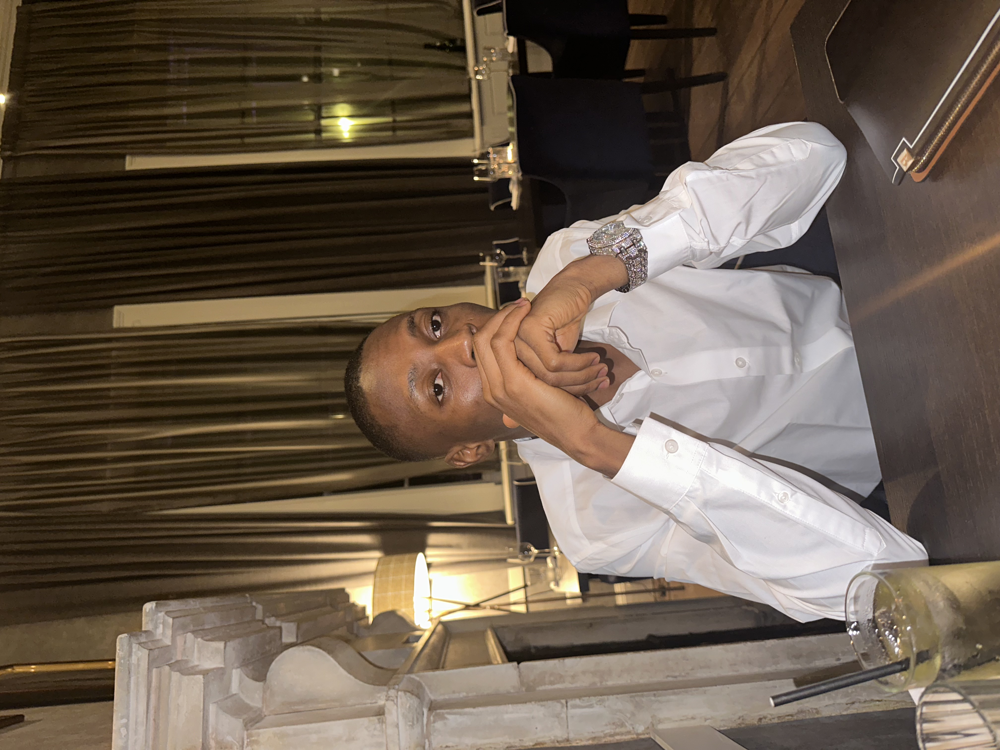

# Welcome to Damilola's GitHub Page!

<!---->
<!---->

Hey there! 👋 I'm Adebowale Damilola Emmanuel, a passionate web developer. Welcome to my GitHub profile!

## About Me
I hold an MSc in Mechatronics with a focus on control systems. My dissertation explored the speed control of a DC motor using fuzzy logic and PID controllers. After completing my master's degree, I decided to pursue my interest in web development. I love building things that are both functional and beautiful.

## Skills and Technologies

- Programming Languages: C++, JavaScript, HTML, CSS
- Frameworks: Bootstrap
- Tools: Git, VS Code

- ## Education

- **HyperionDev** | Fullstack Web Dev Bootcamp | *(March 2024 - Present)*
- **Althaus Digital** | IT Solution Bootcamp | *(January 2024 – March 2024)*
- Master of Science in Mechatronics | **De Montfort Univerity Leicesty** | *(Oct 2022 - Nov 2023)*
- HND Civil Engineering | **The Federal Polytechnic Ado-Ekiti** | *(Nov 2014 - Nov 2019)*

## Certifications

- Become a C++ Master | Programiz | August 2023
- Certified SOLIDWORKS Associate (CSWA) in Mechanical Design by Dassault Systèmes | June 2023
- Google Project Management | Google on Coursera | September 2023

## Get in Touch

Feel free to connect with me on [LinkedIn](www.linkedin.com/in/adebowaleemmanuel) and [Twitter](https://twitter.com/damilordz). Let's collaborate and build amazing things together!

Happy coding! 😊

<!--
**Damilordz/Damilordz** is a ✨ _special_ ✨ repository because its `README.md` (this file) appears on your GitHub profile.

Here are some ideas to get you started:

- 🔭 I’m currently working on ...
- 🌱 I’m currently learning ...
- 👯 I’m looking to collaborate on ...
- 🤔 I’m looking for help with ...
- 💬 Ask me about ...
- 📫 How to reach me: ...
- 😄 Pronouns: ...
- ⚡ Fun fact: ...
-->
